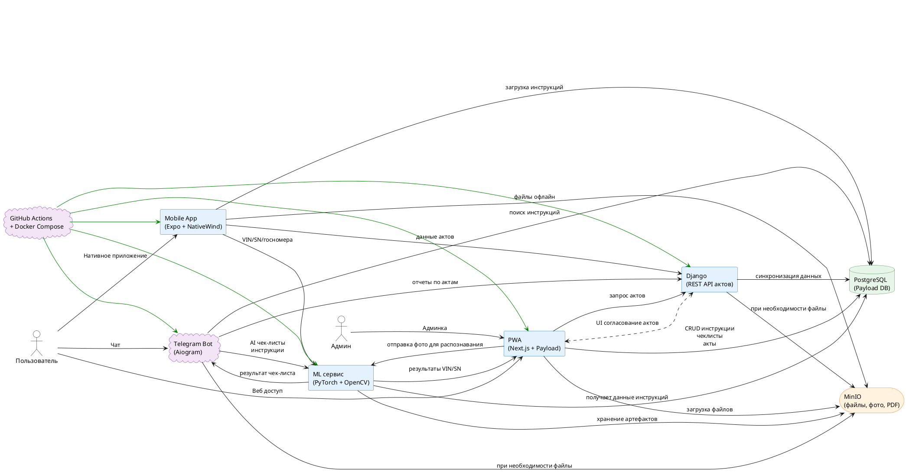

[Ссылка](//www.plantuml.com/plantuml/png/VCzDJi0W40NWFQSWyGBz2TNkZ9va2ZD8IXapJ5V6kulHXGsfR_aWNzuyLmNHyyWc8wbLjfBYczgG1BqcBgRkgRo3m66_6oWne_qmjkK5_1w5pn9UERFO1vnfel3pnX9GVllHBSuFvlEFvJEVuSwX6HsvtbbWt5QuE04KDgZtavx8uTfJ4pw6URfGLLaWtaf4RTRGIqYB7wx7WM_KFqvBvsovVMoA-UgqQdgQYABeVdx52oxKG65lZB5Ir2QbLCh7mheeCC4YpZIq4jWL45rWWd5lNBeTf6DBI-4llFUFF6SUbpud8mitdVVUFUVTUywzCwabwn_wIW_D5zt3yvUEpA6EkPVmLztLbxglHvvdhPnOyhVzJMJ7hUrQy23V2BbxEA7gBIKnRzp2YSfg7h2olzUUtcgfILMfxs-7zGrBGD35peTh3JpppIOeStlD4FXolTtOzLSRmGs5ntznIieSwDXqK7xV781OsLyATzRVWhlGz8FP5SkRBxcimXOM8S2BSzKbbQyKbOxq0EhXWiLRXET9vw4aRBKtT_pggnAJM1cgyCp2Ru8jpxQNXJM2uWAGvYEkle2f9rCAwoiccLALmdDBJ62txhvej5z-M5Fvv9rerO99LGZNt_axQZPytmnRlYtDtrrejZpllbgkpYrMlNyrKULoJsYnUgJqDnoTATr5_WDpQ8xqzTqqQIMvFncx6ywk4FezEUyZFW8gLlhQTB0TOlCRy17MiJUUAgV2yQ4Uw8ZYE1oC4IFs0ZYxk5nGn2L2Ef0oC9-mxzS2ynav1iZMJs8djO1TvKekidOpNG-XSzAnGa8bRQAuCRf4A5j67H5a4IfTf9r3SweOmWnUWzf3-OH5b6fERo-oqoHvUHdwuCmSzOhbdYpIofc1qlGWI_-5otCpebOQGnkIAoHjf2yTYgZD5vMrCUVwcEMt1tngL4m7p1uWc0jcC8VfotIKoYdzI0P5mROO8i_CCNwxo79f1nQXyNj4iyQV2e-pbxOgtTvimuGfLJWvO1ismsGxSe2qQALOdgcMP_GvQ-EWeygOGo0ur_qkPm6vJtISwdVgooLsfXgEOexWOSG6fcxBaiHBN477faEAl7ie0N2ykLGgnGW9mvhPGxXX9QDg-IxQHxfWw65HJ7h5X6m32pEdJkdcMDZ_Em32VpmzBLKl5v4Sb7FsZ2jv2TEsozVJFbJkzJtKxWTlhFwiOvdNh1WRdd6EtcQSYdTF_M03VuN-0000)
