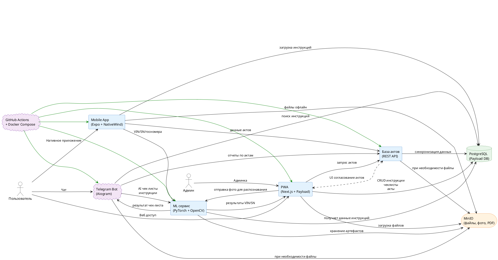

[Ссылка](//www.plantuml.com/plantuml/png/TCz1JiGm30NGVKuHYGjq6gKmEmGdSHCxH9F6o75NYBlJ2XPKKVxoMthoVsqAeljMJ45Igsmbfm-rCGi6pLnDU-Jw2GARFHkegQ3zClR86uH74jvhVEV2Of_GqKpnzyOIKVxwcrzycCptFoiKtkF88OUUVEyiS5llS74YAApGnY-zaCTxJytu7DryePgoG1fAHEHmwYMa9KpNSH0EQkoSwPor_7HQDKrDGr5qdr_n1XVgG67lE8wLedQcb4hvM5WN1J9OnAH3AWEx0g8Bd47TEoxT1cbiQIdyXVV-aUVaSKtCH1PkchntptdtddFlonH0dE9Oilwkh_J8VD9zF7_gq1pgY6i9VzOzVQa7Ukmurig99NVRtKHsdDffUFUABP-h-nEg6IY9EKaB9sghHS2gxbvdUYjGawhMtD_scnkMW60QE--ljV0ijjkWpEsrVU2hpKvhrrrjUJSKRl_5gIXpe2FJHVa3Sm1YRN_9trb_3Uv2s_LcLonllf9cwIywXEPGuJ64Q8W7ixI5iAyMv-fBgbWhMwBTT1mP0KZoWyxcZbj_KM4sgqULdbZuJJ1mR9zPOSihBm1ftYFP1TmzcL9ulsBQALKhFRN46FR7vcUjplDtQweONuwWuKsgah_-njrHi_xRjX-ujZHtTw4TECvTjLoVMwmx_-gcAXGUqMlrGEcls3fJkeVy1-RG7EdhssdIKt9_C7OxdEqXz5kyFq1y35IazBNfOZd2uXVWOxn7JZ9UgGgJJJtK8SLnIXWZHkm5S7PnkQI8YuLq8MLeFc0zQ7Zc8t8CaMqGnquQ7llCDpd8sirqVOJEOtgV2PMqYU8IT8LGjemwGiWYLBf8EqVcL364ORm6jO_o2GifrPpAGJVJ97bn6FkGcaBeJQwHl6ILCmEbwM6U_eiqBvqHjT8OsX0V8Mb3VPcYYDfYMLaR2saVy_nsWC-CYkc2sGS4Sy4CvZ1xc0upEQKVyQ0es1P1v9avncyFMIxjm2AKt2EQbNmp7CvUrgfiU_CD4wPKaSe1sx0OnSjn2aYBLihLcNfrHf-pDWuwgemu189Bkz_ZB23tYOuo_Svymc1dRiD7vWWUXcnWvhGyIJmaBUWOnuCYTmyb08wRIwLIZ90mhBazX1jMCggMxw9zP0k67XR5f5TCo3QmC7EQAjqS2_j_1q3u3wUdfUhbCfA3SiwUyKqkOTPs-NhQXogyl8FQNU-LrP-tBVEQ5sF3S_RHsvnTyUwnwstWFz5l)
